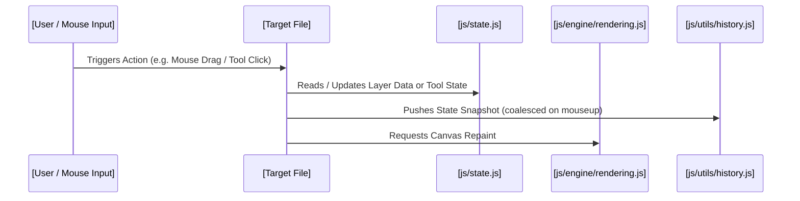

# TileWeaver File Onboarding & Deep-Dive Analyzer Skill

> **Usage Instruction**: Invoke this skill whenever a developer or AI coding agent needs a comprehensive, high-clarity onboarding guide for a specific file in **TileWeaver**. Generates a structured `onboarding_guide_[filename].md` artifact complete with Mermaid sequence/dataflow diagrams, subsystem classification, coordinate space lifecycle mapping, 60 FPS rendering budget and memory safety ratings, state invariant audits, and clickable symbol links.

---

## 1. Subsystem Classification Engine

During analysis, classify the target file into one of TileWeaver's primary subsystems:

- **Core State & Bootstrapper**:
  - Namespace bootstrapper and application lifecycle in [`js/app.js`](file:///c:/Users/kkmcl/Documents/GitHub/TileWeaver/js/app.js).
  - Single-source-of-truth reactive state store (`mapLayers`, `tilesets`, `autotiles`, `animatedTiles`, `passabilityGrid`, `regionGrid`, `selectedStamp`, `stampTransform`, `terrainVertices`) in [`js/state.js`](file:///c:/Users/kkmcl/Documents/GitHub/TileWeaver/js/state.js).
  - Constants, bitmask slot definitions (`MODE_SLOTS`), tool IDs, passability flags, and layout presets in [`js/constants.js`](file:///c:/Users/kkmcl/Documents/GitHub/TileWeaver/js/constants.js).
- **Canvas Rendering & Viewport Engine**:
  - Dual-canvas architecture (`map-canvas`, `tileset-canvas`), 60 FPS `requestAnimationFrame` render loop, transformed tile rendering (`drawTileTransformed`), sub-quadrant cell compositing (`drawAutotileCellSubQuadrants`), and overlay drawing (grid, passability O/X/*, region IDs, terrain vertex pins, ghost stamp hover) in [`js/engine/rendering.js`](file:///c:/Users/kkmcl/Documents/GitHub/TileWeaver/js/engine/rendering.js).
  - Viewport navigation, center-locked zoom clamping (0.25x - 4.0x), spacebar pan drag, DPR compensation, and coordinate translation (`screenToMap`, `screenToTileset`, `canvasToGrid`) in [`js/ui/viewport.js`](file:///c:/Users/kkmcl/Documents/GitHub/TileWeaver/js/ui/viewport.js).
- **Autotiling, Dual-Grid & Bitmask Math**:
  - 5 autotile algorithms (`9slice` 3x3 block, `dualgrid` 4-corner vertex bitmask, `16tile` cardinal paths, `25tile` slopes, `47tile` RPG Maker blob), sub-quadrant 2x2 cell compositing, and neighbor recalculation triggers in [`js/engine/autotile.js`](file:///c:/Users/kkmcl/Documents/GitHub/TileWeaver/js/engine/autotile.js).
- **Drawing Tools & Input Dispatcher**:
  - Tool state machine (paint, autotile, animtile, bucket fill, line, rect, erase, picker, passability, region, terrain), stroke state lifecycle (`onMouseDown`, `onMouseMove`, `onMouseUp`), Bresenham line stroke interpolation to prevent drag gaps, multi-tile stamp pasting, and flip/rotation matrix transforms ($90^\circ, 180^\circ, 270^\circ$, H-flip, V-flip) in [`js/ui/tools.js`](file:///c:/Users/kkmcl/Documents/GitHub/TileWeaver/js/ui/tools.js).
- **Asset, Tileset & Extrusion Pipeline**:
  - Tileset palette manager, sprite sheet slicing, collection tilesets, and animation frame sequencer in [`js/ui/tilesetManager.js`](file:///c:/Users/kkmcl/Documents/GitHub/TileWeaver/js/ui/tilesetManager.js).
  - Central asset store, 4-way ingestion pipeline, dependency graph calculation, and safe orphan cleaner in [`js/ui/assetManager.js`](file:///c:/Users/kkmcl/Documents/GitHub/TileWeaver/js/ui/assetManager.js).
  - 1px edge-clamping extrusion engine to eliminate web canvas sub-pixel tile bleeding seams in [`js/engine/extruder.js`](file:///c:/Users/kkmcl/Documents/GitHub/TileWeaver/js/engine/extruder.js).
- **Layer Hierarchy & Matrix Management**:
  - Dynamic layer stack reordering, active layer target, visibility/opacity/blend modes (`source-over`, `multiply`, `screen`, `overlay`), and 2D grid matrix data structure (`layer.data[y][x]`) in [`js/ui/layerManager.js`](file:///c:/Users/kkmcl/Documents/GitHub/TileWeaver/js/ui/layerManager.js).
- **Export, Import & Serialization Engine**:
  - Native JSON v3.3 specification, Tiled TMJ (.json) exporter/importer with 32-bit transformation flags (`0x80000000` H-flip, `0x40000000` V-flip, `0x20000000` diagonal flip), high-DPI canvas PNG exporter, and CSV matrix exporter in [`js/engine/exportImport.js`](file:///c:/Users/kkmcl/Documents/GitHub/TileWeaver/js/engine/exportImport.js).
- **Undo / Redo History Stack Manager**:
  - Deep JSON snapshot serialization (`pushHistoryState`), pointerup stroke coalescing, state restoration (`restoreState`), and toolbar action synchronization in [`js/utils/history.js`](file:///c:/Users/kkmcl/Documents/GitHub/TileWeaver/js/utils/history.js).
- **Modals, Wizards & Material Studio**:
  - Interactive autotile bitmask slot mapper modal in [`js/ui/autotileWizard.js`](file:///c:/Users/kkmcl/Documents/GitHub/TileWeaver/js/ui/autotileWizard.js).
  - Material Swatches Studio, procedural composite thumbnails, priority stack, and ribbon HUD in [`js/ui/terrainSwatches.js`](file:///c:/Users/kkmcl/Documents/GitHub/TileWeaver/js/ui/terrainSwatches.js) and [`js/ui/materialProperties.js`](file:///c:/Users/kkmcl/Documents/GitHub/TileWeaver/js/ui/materialProperties.js).
  - Tile gameplay properties inspector in [`js/ui/tileProperties.js`](file:///c:/Users/kkmcl/Documents/GitHub/TileWeaver/js/ui/tileProperties.js) and [`js/ui/objectInspector.js`](file:///c:/Users/kkmcl/Documents/GitHub/TileWeaver/js/ui/objectInspector.js).
  - Upload and import wizard modals in [`js/ui/uploadWizard.js`](file:///c:/Users/kkmcl/Documents/GitHub/TileWeaver/js/ui/uploadWizard.js) and [`js/ui/importWizard.js`](file:///c:/Users/kkmcl/Documents/GitHub/TileWeaver/js/ui/importWizard.js).
  - Header actions and notification toast system in [`js/ui/header.js`](file:///c:/Users/kkmcl/Documents/GitHub/TileWeaver/js/ui/header.js) and [`js/utils/toast.js`](file:///c:/Users/kkmcl/Documents/GitHub/TileWeaver/js/utils/toast.js).
- **DOM & Design System**:
  - Semantic HTML markup structure in [`index.html`](file:///c:/Users/kkmcl/Documents/GitHub/TileWeaver/index.html) and dark theme CSS tokens/layout docks in [`css/styles.css`](file:///c:/Users/kkmcl/Documents/GitHub/TileWeaver/css/styles.css).

---

## 2. Mandatory Analysis Steps

### Step 1: Deep Inspection & Subsystem Classification
1. View target file contents completely using `view_file`.
2. Map all public exports, internal helper functions, state variables, DOM bindings, and event listeners.
3. Assign the file to its primary subsystem and identify its exact execution context (e.g. 60 FPS `requestAnimationFrame` render tick, pointer drag event, modal workflow, serialization pipeline).

### Step 2: Call Graph & Trigger Tracing
Use `grep_search` across the workspace to trace upstream dependencies, incoming triggers, and downstream dependents:
- **Incoming Triggers**: What DOM events, mouse clicks, wheel zooms, tool strokes, modal actions, or animation loops invoke code in this file?
- **Upstream Dependencies**: What state properties, constants, utility functions, or engine modules does this file read from or depend on?
- **Downstream Dependents**: What other modules or UI views consume this file's functions, classes, or state mutations?

### Step 3: Coordinate Space & State Invariant Mapping
- **Coordinate Space Lifecycle**: If the file touches mouse input, rendering, or tools, map the exact coordinate transform pipeline:
  $$\text{Screen (px)} \xrightarrow{\text{DPR / Canvas Offset}} \text{Canvas Buffer (px)} \xrightarrow{\text{Pan \& Zoom}} \text{Map World (px)} \xrightarrow{/\text{TILE\_SIZE}} \text{Grid Cell } (x, y) \xrightarrow{\text{Matrix Index}} \text{layer.data}[y][x]$$
- **State Store Subscriptions**: Document which properties of `window.TileWeaver.state` are read or mutated by this file.

### Step 4: 60 FPS Rendering Budget, Memory & State Safety Audit
Audit the target file against TileWeaver's core engineering invariants:
- **60 FPS Frame Budget**: Are operations executed inside or called by `requestAnimationFrame` bounded within 16.6ms without blocking UI responsiveness?
- **GC Allocation Pressure**: Are heap objects, arrays, or canvas `ImageData` instances instantiated inside hot paths (e.g. mouse drag, render loop) instead of reusing cached buffers?
- **State Mutation Integrity**: Are state modifications synchronized through `js/state.js` and properly recorded via `history.pushHistoryState()` for undo/redo consistency?
- **Matrix & Coordinate Safety**: Are 2D layer matrix accesses `layer.data[y][x]` protected against out-of-bounds, negative grid coordinates, or undefined layer objects?
- **DPI & Coordinate Transformation**: Does the file correctly account for device pixel ratio (`dpr`), canvas pan offsets (`panX`, `panY`), and zoom factors (`zoomLevel`)?

---

## 3. Onboarding Guide Artifact Blueprint

Generate an artifact named `onboarding_guide_[filename].md` with the following structure:

```markdown
# 📚 Developer Onboarding Guide: [File Name]

> **Subsystem**: [Subsystem Name] | **Execution Context**: [60 FPS Render Loop / Pointer Event / Modal / Exporter]

## 1. 🗺️ TL;DR & Mental Model
- **Primary Purpose**: High-level summary (2-3 sentences).
- **Core Responsibilities**: Bulleted list of key duties.
- **Mental Model**: Intuitive analogy explaining how this file fits into the TileWeaver architecture (e.g. "Acts as the conductor translating pointer drag coordinates into Bresenham-interpolated 2D layer matrix writes").

## 2. 🔄 Control Flow & Mermaid Architecture Diagrams


## 3. 📐 Coordinate Space & State Dependency Matrix
| State Property / Dimension | Access Type | Purpose / Transformation | Invariant / Boundary Guard |
| :--- | :--- | :--- | :--- |
| `state.mapLayers[active].data` | Read / Write | 2D tile cell grid matrix | $0 \le x < \text{mapWidth} \land 0 \le y < \text{mapHeight}$ |
| `state.zoomLevel` | Read | Viewport scaling factor | Clamped to $[0.25, 4.0]$ |

## 4. 🔍 Code & Symbol Deep Dive (Clickable Line Links)
- [`symbolName()`](file:///c:/Users/kkmcl/Documents/GitHub/TileWeaver/js/path/to/file.js#LXX-LYY):
  - **Purpose**: Detailed breakdown of functionality.
  - **Inputs & Outputs**: Parameter types, shapes, and return values.
  - **Logic & Invariants**: Step-by-step logic, state mutations, and edge case handling.

## 5. ⚡ Canvas Rendering, Performance & Memory Safety Audit
- **Frame Budget Impact**: Zero / Low / Medium / High (Budgeted for <16.6ms 60 FPS loop).
- **Memory & Allocation Efficiency**: Notes on object reuse, offscreen canvas pooling, or GC safety in hot paths.
- **State & History Safety**: Verifies whether state mutations cleanly integrate with `history.js` undo/redo snapshots.
- **Coordinate Space Accuracy**: Verifies DPI scaling and canvas transform handling.

## 6. 🎮 End-to-End Execution Scenario
- Step-by-step walkthrough of a concrete user interaction (e.g. *"User activates Autotile tool and paints a 3x3 water pond with dual-grid terrain"* or *"User imports a Tiled TMJ map with flipped tiles"*).

## 7. 🛠️ Developer Modding, Extension & Test Guide
- **How to Extend / Add Features**: Actionable guide for adding new capabilities to this file.
- **Gotchas & Edge Cases**: Traps to avoid (e.g. forgetting to trigger autotile recalculation for adjacent neighbor cells, coordinate rounding errors, breaking undo/redo serialization).
- **Automated Verification**: Related test suites in `scripts/` (e.g. `node scripts/test_unified_add_tileset.js`, `npm test`).
```

---

## 4. Core Execution Rules

- **No Guesses**: Never infer function signatures or data structures without viewing authoritative file contents via `view_file`.
- **Clickable Links**: All file and symbol references must use clickable markdown syntax (`[file.js](file:///c:/Users/kkmcl/Documents/GitHub/TileWeaver/js/file.js#L10-L25)`).
- **Web Standards & 60 FPS Focus**: Keep analysis centered on browser 2D canvas rendering, responsive DOM layout, memory allocation efficiency, and deterministic state management.
